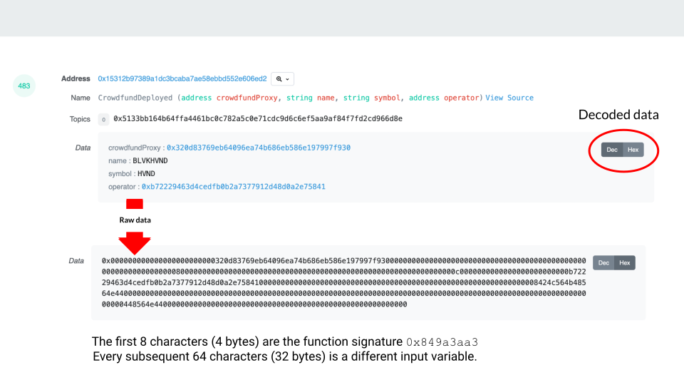

{::options parse_block_html="true" /}

#  Basic call and event data on Ethereum

[Lecture slides](https://docs.google.com/presentation/d/1I6vDOS52uMCmWg3KIbuKYe8lK-8_ol9bEksIUEHNNLI/edit#slide=id.p)

## Data abstractions

> Ethereum is a distributed network of computers running software (known as nodes) that can verify blocks and transaction data. You need an application, known as a client, on your computer to "run" a node. [ref](https://ethereum.org/en/developers/docs/nodes-and-clients/)

There are typically three layers of abstraction when interacting with raw Ethereum data;

1. A client
  - an implementation of Ethereum that verifies all transactions in each block, keeping the network secure and the data accurate
  - you are running one of the computers that makes a blockchain possible
  - > A node is a software application that implements the Ethereum specification and communicates over the peer-to-peer network with other Ethereum nodes. A client is a specific implementation of Ethereum node.
2. Node-as-a-Service
  - third parties or a friend can run a node (running a node is non-trivial in a PoW world) They will provide a public API to write and read from the blockchain
  - if you go to MetaMask -> Settings -> Networks -> Mainnet. The `RPC URL` will display the Node-as-a-Service provider
  - Anytime you're connecting your wallet to a DAPP you're doing so using a Node Endpoint-as-a-service
  - If you were running a client locally, you could point your wallet to your local host
3. Data mappers 
  - tools like Dune and Flipside that do all the ETL of reading from a Node Endpoint and provide an interface to query a SQL database
  - [check out the tools section](#analytics-tools)


## The lifecycle of a transaction

> There are two different types of transactions in Ethereum: plain value transfers and contract executions. 
> 
> * A plain value transfer just moves Ether from one account to another.
> * If however the recipient of a transaction is a contract account with associated EVM (Ethereum Virtual Machine) bytecode - beside transferring any Ether - the code will also be executed as part of the transaction.
>  
> GEth [source](https://geth.ethereum.org/docs/dapp/tracing)

- An ERC20 token is stored on the blockchain
- A transfer function is called, specifying the recipient of that token and how much of the token to transfer
- That transfer must be signed by the sender
- That transaction is then sent to the blockchain to verify. It sees;
  -  (1) A called/signed transaction
  -  (2) Sub-interactions, called a `trace`
     -  internal transactions
     -  "transactions can trigger smaller atomic actions that modify the internal state of the Ethereum Virtual Machine" [ref](https://ethereum.stackexchange.com/questions/6429/normal-transactions-vs-internal-transactions-in-etherscan)
-  The transaction calls a `transfer` function, this emits a log (like a notepad of every action that's happened in the transaction)

Dune will create a table named `ethereum.transactions` that represents the called/signed transaction. 

| Field  | Description  |
|---|---|
| From  | Sender address   |
| To  | Receiver address or the contract interacted with  |
| Success  | Whether the transaction was successful   |
| Value  | __ETH__ value transferred from the signer, if not transferring ETH, value will be 0   |
| Gas Price  | This is how much ether is being paid per gas unit   |
| Gas Used | Amount of gas this event consumes   |
| Call Data | Event specific data, typically, sent to a contract account indicating the contract’s function to be called and the arguments to that function.   |
| Hash | hash unique to that transaction   |
| Block number | block number the transaction was mined on   |
| Block time | timestamp when verified   |

Dune will create a table named `ethereum.logs` that represents the transfer function.

> Logs are very helpful, as they can be used to emit state variables instead of just the function call values
>  
> Function calls change the state data, which we'll need to piece together the overall state data by aggregating over transaction history.  -- _Andrew Hong_

Think of topics like variables. They will vary depending on the contract called. Topic 0 is (typically/always) the event signature, it's all the instances of a function call for a contract.

In Etherscan you'll see `decoded` data;



All the tables can be linked using the transaction hash.


__Very__ useful links:

[Dune's docs](https://docs.dune.xyz/data-tables/data-tables/raw-data/ethereum-data)

[Andrew Hong, decomposition of a transaction](https://ath.mirror.xyz/mbR1n_CvflL1KIKCTG42bnM4HpfGBqDPNndH8mu2eJw)

[What is Ethereum?](https://github.com/ethereumbook/ethereumbook/blob/develop/01what-is.asciidoc)

[Ethereum 101](https://secureum.substack.com/p/ethereum-101)

[Preethi Kasireddy, how does Ethereum work](https://www.preethikasireddy.com/post/how-does-ethereum-work-anyway)

## Stop reading for now, go query

Visit Dune >>> [https://dune.xyz/](https://dune.xyz/)

```SQL
-- Look at transaction data and compare them on etherscan
select *
from ethereum.transactions
limit 10
```

```SQL
select 
    data 
    , bytea2numeric(data) -- this "decodes" the contract specific data
    , bytea2numeric(data) / 1e6 -- there are no decimals on-chain, divide by 10^6
from ethereum.logs
limit 10
```

All smart contracts are essentially stored as data tables, every function or event from that contract is its own table.

Dune has translated ([decoded](https://docs.dune.xyz/data-tables/data-tables/decoded-data)) all these contracts into useable contracts for you. You will sometimes need to work in the raw base tables of `transactions`, `logs` and `traces`.

When looking at a contract's code and the logs tables

- Topics are indexed parameters
- Data is non-indexed

[ref](https://towardsdatascience.com/your-guide-to-intermediate-sql-while-learning-ethereum-at-the-same-time-7b25119ef1e2) Andrew's guide to "intermediate SQL while learning Ethereum at the same time"
