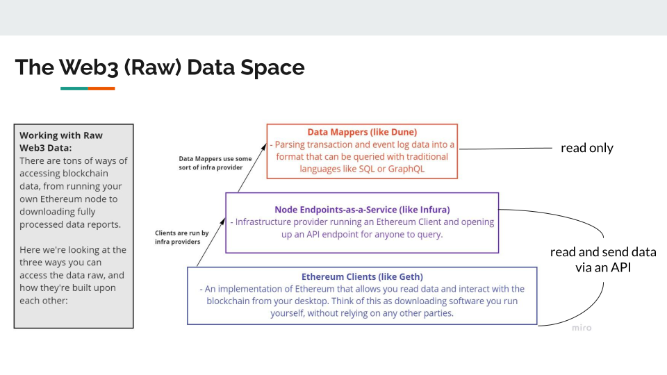
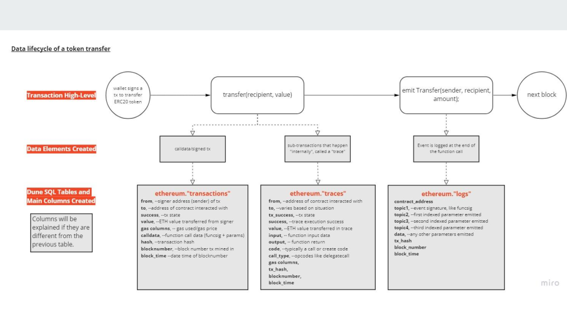

# # Basic call and event data on Ethereum

[Lecture slides](https://docs.google.com/presentation/d/1I6vDOS52uMCmWg3KIbuKYe8lK-8_ol9bEksIUEHNNLI/edit#slide=id.p)

### Data abstractions

> Ethereum is a distributed network of computers running software (known as nodes) that can verify blocks and transaction data. You need an application, known as a client, on your computer to "run" a node. [ref](https://ethereum.org/en/developers/docs/nodes-and-clients/)

There are typically three layers of abstraction when interacting with raw Ethereum data;

1. A client
  - an implementation of Ethereum that verifies all transactions in each block, keeping the network secure and the data accurate
  - you are running one of the computers that makes a blockchain possible
2. Node-as-a-Service
  - third parties or a friend can run a node (running a node is non-trivial in a PoW world) They will provide a public API to write and read from the blockchain
  - if you go to MetaMask -> Settings -> Networks -> Mainnet. The `RPC URL` will display the Node-as-a-Service provider
  - Anytime you're connecting your wallet to a DAPP you're doing so using a Node Endpoint-as-a-service
  - If you were running a client locally, you could point your wallet to your local host
3. Data mappers 
  - tools like Dune and Flipside that do all the ETL of reading from a Node Endpoint and provide an interface to query a SQL database
  - [check out the tools section](#analytics-tools)

### The lifecycle of a transaction

- An ERC20 token is stored on the blockchain
- A transfer function is called, specifying the recipient of that token and how much of the token to transfer
- That transfer must be signed by the sender
- That transaction is then sent to the blockchain to verify. It sees;
  -  (1) A called/signed transaction
  -  (2) Sub-interactions, called a `trace`
-  The transaction calls a `transfer` function, this emits a log (like a notepad of every action that's happened in the transaction)

Dune will create a table named `ethereum.transactions` that represents the called/signed transaction. 

| Field  | Description  |
|---|---|
| From  | Sender address   |
| To  | Receiver address or the contract interacted with  |
| Success  | Whether the transaction was successful   |
| Value  | __ETH__ value transferred from the signer, if not transferring ETH, value will be 0   |
| Gas Price  | This is how much ether is being paid per gas unit   |
| Gas Used | Amount of gas this event consumes   |
| Call Data | Event specific data   |
| Hash | hash unique to that transaction   |
| Block number | block number the transaction was mined on   |
| Block time | timestamp when verified   |

Dune will create a table named `ethereum.logs` that represents the transfer function.

Think of topics like variables. They will vary depending on the contract called.

All the tables can be linked using the transaction hash.

Very useful links:

[Dune's docs](https://docs.dune.xyz/data-tables/data-tables/raw-data/ethereum-data)

[Andrew Hong decomposition of a transaction](https://ath.mirror.xyz/mbR1n_CvflL1KIKCTG42bnM4HpfGBqDPNndH8mu2eJw)

[Preethi Kasireddy, how does Ethereum work](https://www.preethikasireddy.com/post/how-does-ethereum-work-anyway)
